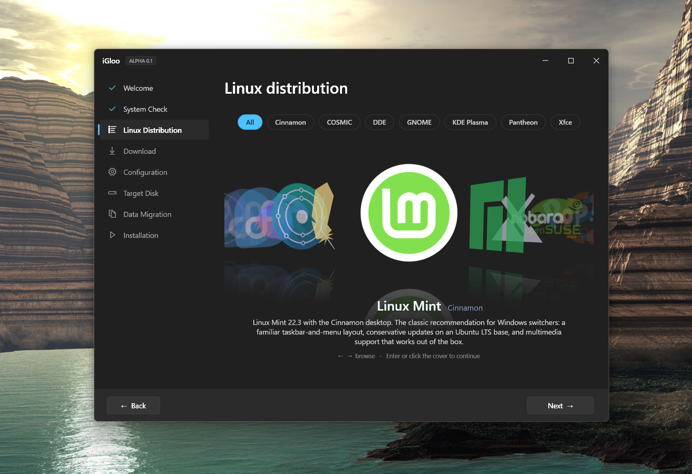

  

  
  
  
  
  

  <a href="docs/architecture.md">Architecture</a> 
  <a href="distros/">Distributions</a> 
  <a href="ROADMAP.md">Roadmap</a> 
  <a href="CONTRIBUTING.md">Contributing</a> 
  <a href="SECURITY.md">Security</a>

# iGloo

iGloo is a professional deployment and migration engine designed to
transition Windows environments to Linux natively without external media.

Unlike traditional single-purpose installers iGloo unifies automated disk
partitioning comprehensive user data migration, hardware configuration and
full system rollback into a single automated workflow.

## Key Capabilities

- **Native Deployment Mechanism:** Automates low-level disk repartitioning to
  shrink the host Windows partition, allocate a temporary recovery partition,
  and stage the target Linux installation image directly on internal storage.
- **Automated Data Migration:** Detects and transfers user profile data,
  documents, the desktop wallpaper, active browser sessions, saved login
  credentials and localized Wi-Fi configurations directly to the new home
  directories. Gecko
  browsers (Mozilla Firefox, Zen Browser, Waterfox) migrate at profile level,
  which carries saved passwords with the profile. Chromium browsers
  (Google Chrome, Microsoft Edge, Brave, Vivaldi, Opera) get saved passwords
  decrypted on Windows and re-encrypted for the target Linux account. Browsers
  that enforce App-Bound Encryption (Chrome 127 and later, current Edge and
  Brave builds) are detected and skipped.
- **Pre-Configuration Engine:** Configures the target system bootloader,
  identifies compatible graphics drivers (including NVIDIA), registers native
  keyboard layouts, reproduces the Windows display layout (per-monitor
  resolution, refresh rate, rotation) and queues native Linux alternatives for
  detected Windows applications.
- **Bi-Directional Lifecycle Management:** Detects existing iGloo-deployed
  Linux instances to provide a clean, automated removal pipeline that safely
  deletes Linux partitions, purges EFI boot entries and reclaims unallocated
  space back into the Windows partition.

## Status

**iGloo is alpha software. It modifies the partition table and the boot
configuration. Back up all important data before running it. Do not run it on
production machines.**

| Distribution | Installer stack | Validation state |
|---|---|---|
| **Linux Mint Cinnamon** | Ubiquity / preseed (casper) | Validated end-to-end on physical hardware (NVIDIA RTX 5070): unattended installation, dual-boot preservation, NVIDIA driver installation, display layout (resolution, refresh rate, rotation), keyboard layout, wallpaper and file migration. |
| **Fedora KDE** | Anaconda / kickstart | Validated end-to-end on physical hardware (NVIDIA RTX 5070): dual-boot beside Windows, NVIDIA driver built for the running kernel (the agent pre-installs the matching `kernel-devel-matched` so the akmods dependency chain pulls no surprise kernel), the GRUB default pinned to the verified kernel, display layout, wallpaper and file migration. |
| **Debian 13** | debian-installer + live-installer / preseed | Validated end-to-end on physical hardware (NVIDIA RTX 5070): offline installation that copies the Live image squashfs and requires no network until first boot, dual-boot preservation, display layout, keyboard layout (azerty), wallpaper and file migration. |
| **Ubuntu** | subiquity / autoinstall (cloud-init) | In development. ISO staging, casper/toram boot, autoinstall delivery and partition preservation are individually validated. Parked on an installer disk-release defect. Full analysis in [`distros/ubuntu/STATUS.md`](distros/ubuntu/STATUS.md). |

The application catalog lists 15 additional distributions with the status
"coming soon". These entries contain metadata and logos only. Only the four
distributions listed above implement a complete installation pipeline.

### Secure Boot and NVIDIA GPUs

Secure Boot loads only kernel modules signed by a key that the firmware
trusts. The NVIDIA driver is compiled locally on the target machine
(DKMS/akmods), so the resulting module is unsigned and the kernel rejects it.
The installation completes, but the desktop starts without hardware
acceleration at a reduced resolution. The bootloader is unaffected because
shim and GRUB carry Microsoft signatures so this condition is frequently
misdiagnosed as a driver defect.

The pre-flight check detects the combination of an NVIDIA GPU and enabled
Secure Boot and displays a warning. Two resolutions are available:

- Disable Secure Boot in the firmware setup. This is the recommended option.
- Enrol a Machine Owner Key (MOK) and sign the module. This retains Secure
  Boot and requires additional steps.

Linux Mint is an exception. Ubuntu publishes pre-built NVIDIA modules signed
by Canonical so iGloo installs those modules when Secure Boot is enabled and
no key enrolment is required.

## Documentation

- [How iGloo works](docs/reference/operation.md) - the install pipeline
- [Safety and security model](docs/reference/safety-model.md) - how iGloo protects your data and your Windows install
- [Building from source](docs/reference/building.md) - requirements, build, tests, verifying an installation
- [Comparison with existing tools](docs/reference/comparison.md) - Wubi, Operese, Mint Stick
- [Adding a distribution](docs/reference/adding-a-distribution.md) - the plugin procedure
- [Repository structure](docs/reference/repository-structure.md)

## Roadmap

The full plan with milestone definitions and prioritization criteria is in
[`ROADMAP.md`](ROADMAP.md). Summary:

- **Completed:** core pipeline (M1-M8), multi-distribution expansion (M9),
  ISO verification hardening (M10), open-source readiness including the
  GPL-3.0 relicensing (M11), a bare-metal validation round for Fedora KDE,
  Linux Mint and Debian on NVIDIA hardware (M18), and the Windows installer
  packaging (M19).
- **In progress:** Linux detection and removal (M13), closed beta on a
  physical-hardware matrix (M15), visual guide (M12).
- **Planned:** an end-user-friendly GRUB boot menu (M17), pre-installation
  snapshot and rollback (M14), v1.0 public release (M16), Ubuntu validation,
  wizard localization, accessibility, LUKS encryption option, reproducible
  builds with signed releases.

## Contributing

The project currently prioritizes the following contributions:

- **Physical-hardware testing** across firmware vendors (AMI, Phoenix,
  Insyde), Secure Boot states and BitLocker configurations.
- **Distribution plugins.** The shared Debian-family agent reduces the cost
  of distributions that use the apt packaging system.
- **Architecture review** from maintainers with installer, partitioning or
  bootloader experience.
- **Architecture Decision Records** in `docs/decisions/`.

Open an issue before starting substantial changes. Build requirements,
analyzer policy and validation rules are defined in
[`CONTRIBUTING.md`](CONTRIBUTING.md).

## License

iGloo is licensed under **GPL-3.0-or-later**. Version 3 was selected because
it is compatible with the Apache-2.0 dependencies distributed with the
application (GPL-2.0 is not) and because it provides an explicit patent grant
and anti-tivoization provisions. The complete rationale is recorded in
[`docs/decisions/010-relicense-gpl3.md`](docs/decisions/010-relicense-gpl3.md).

- License text: [`LICENSE`](LICENSE)
- Copyright notice: [`COPYRIGHT`](COPYRIGHT)
- Third-party dependency licenses: [`THIRD-PARTY-NOTICES.md`](THIRD-PARTY-NOTICES.md)

## Acknowledgments
The project depends on the work of the Fedora Project, Debian, Linux Mint and
Canonical (distributions and installers), the shim and GRUB2 communities
(boot chain) and the Linux kernel community.

In July 2026 iGloo was discussed on the WAN Show (Linus Media Group). The
segment is available as a clip,
["Maybe It's Time to Leave Windows"](https://youtu.be/AkvetmzCh_M?t=354).

---

iGloo is an independent open-source project and is not affiliated with
Red Hat, Inc., the Fedora Project, Debian, Linux Mint, Canonical Ltd. or
Linus Torvalds. "Fedora", "Ubuntu" and "Linux" are trademarks of their
respective owners.
