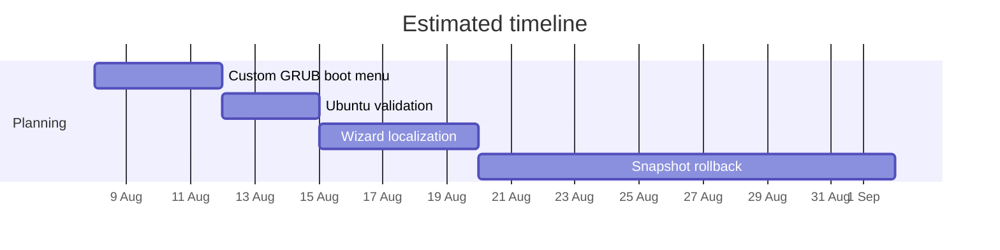

  

  
  
  
  

# iGloo

iGloo is a Windows application that simplifies migration from Windows to Linux.

The key features are:

* **Linux System**:  installs the distribution next to Windows in dual-boot and removes it cleanly, including partitions and boot entries.
* **User Data**: migrates files and user profile data to the corresponding Linux home directories.
* **Web Browsers**: restores active tab sessions and stored login credentials. Firefox-family profiles carry over directly; Chromium-family passwords are decrypted on Windows and re-encrypted for the Linux account.
* **System Settings**: synchronizes Wi-Fi networks, keyboard layout, wallpaper, and the per-monitor display layout (resolution, refresh rate, rotation).
* **Graphics Drivers**: detects the GPU and installs compatible drivers, including NVIDIA, before the first desktop launch.
* **Applications**: installs native Linux alternatives for detected Windows apps.

## Installation

Download the installer from [Releases](https://github.com/gillesduif/iGloo/releases) and run it on Windows 10 (1809+) or Windows 11.

> **Warning:** iGloo is alpha software. It modifies the partition table and the boot configuration. Back up all important data before running it. Do not run it on production machines. NVIDIA systems currently require Secure Boot to be disabled (details are in the [safety model](docs/reference/safety-model.md)).

## Status

| Distribution | Installer stack | Validation state |
|---|---|---|
| **Linux Mint Cinnamon** | Ubiquity / preseed (casper) | Validated on physical hardware |
| **Fedora KDE** | Anaconda / kickstart | Validated on physical hardware: [(open issue)](#1) |
| **Debian 13** | debian-installer + live-installer / preseed | Validated on physical hardware |
| **Ubuntu** | subiquity / autoinstall (cloud-init) | In development. (Full details in [here](distros/ubuntu/STATUS.md).) |

The application catalog also lists 15 additional distributions as planned entries. These contain metadata and logos only.

## Documentation

- [How this project works](docs/reference/operation.md) 
- [The safety and security model](docs/reference/safety-model.md) 
- [Hardware findings register](docs/reference/hardware-findings.md)
- [Building from the source](docs/reference/building.md) 
- [Comparison with other tools](docs/reference/comparison.md)
- [How to add a distribution](docs/reference/adding-a-distribution.md) 
- [This repository structure](docs/reference/repository-structure.md)

## Roadmap

The full plan with milestone definitions are in [here](ROADMAP.md).

## Contributing

Physical hardware testing, distribution plugins and architecture review are
the most wanted contributions.

Open an issue before starting substantial
changes. Please read the rules first: [`CONTRIBUTING`](CONTRIBUTING.md).

## License

This project is licensed under the terms of **GPL-3.0-or-later**.

---

> Discussed on the WAN Show (Linus Media Group), July 2026:
> ["Maybe It's Time to Leave Windows"](https://youtu.be/AkvetmzCh_M?t=354)

---

iGloo is an independent open-source project and is not affiliated with
Red Hat, Inc., the Fedora Project, Debian, Linux Mint, Canonical Ltd. or
Linus Torvalds. "Fedora", "Ubuntu" and "Linux" are trademarks of their
respective owners.
