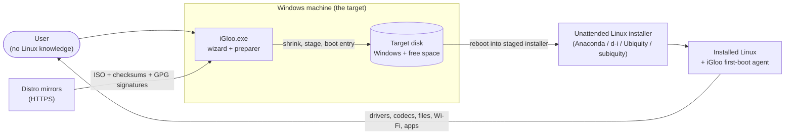
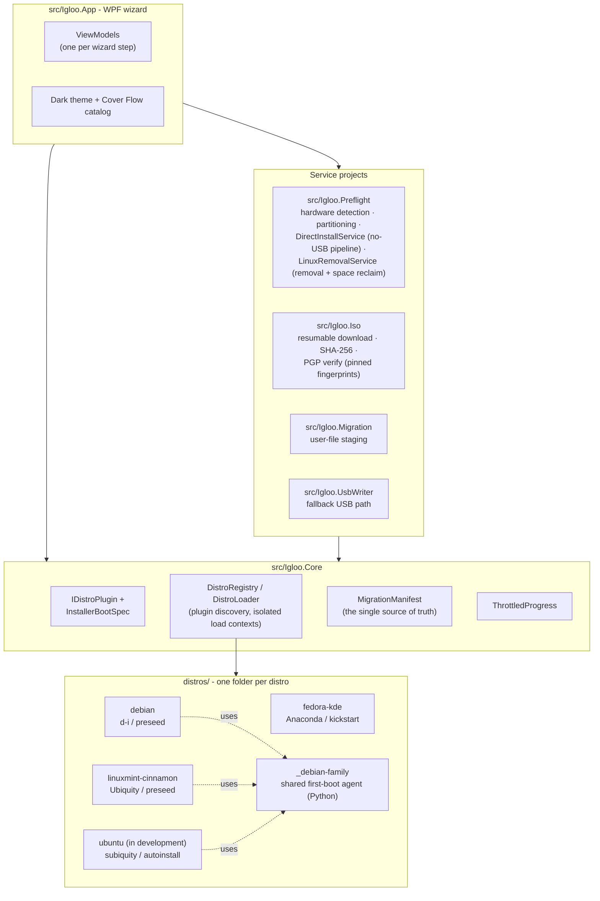
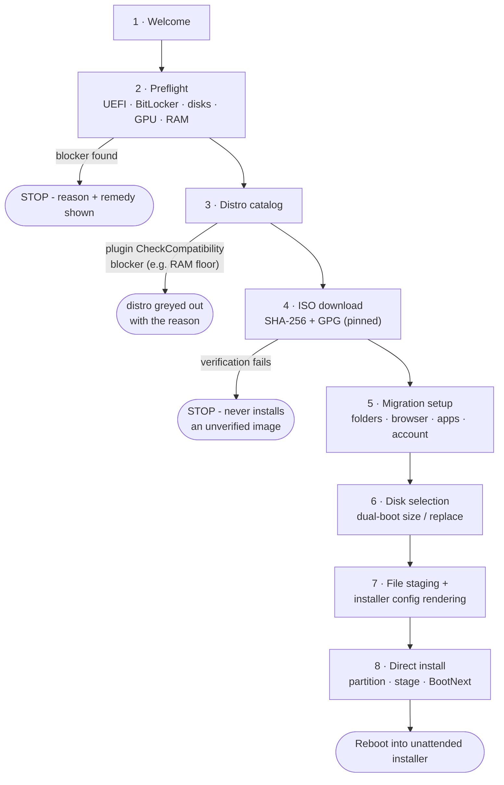
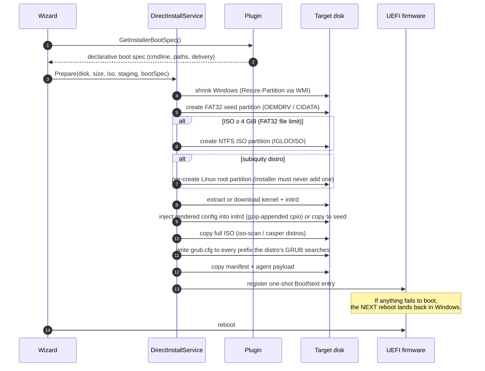
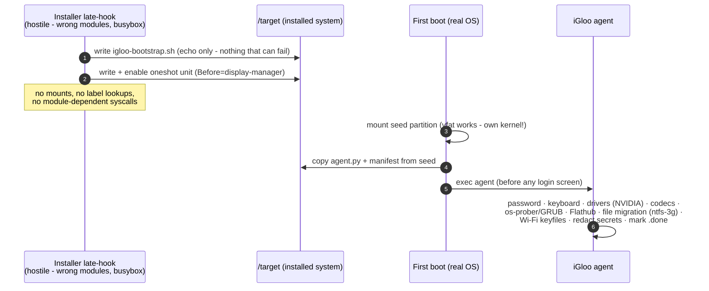
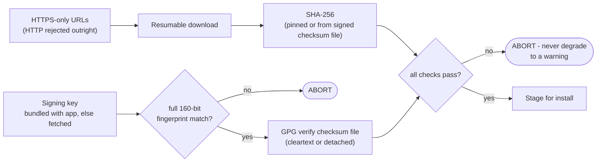

# iGloo Architecture

iGloo is a **two-half system**: a Windows-side *preparer* (the wizard you run) and a
Linux-side *committer* (the distro's own installer plus iGloo's first-boot agent),
communicating exclusively through files staged on dedicated partitions. This split is
forced by a fundamental constraint: destructive disk work cannot be done from the
running Windows system it targets - so **Windows stages, Linux commits**.

This document is the map. For the *why* behind individual decisions, see
[`decisions/`](decisions/); for the research-grade treatment, see the
[white paper](whitepaper/igloo-whitepaper.md).

## 1. System context

Trust boundaries: everything downloaded is verified (TLS + SHA-256 + GPG against a
**pinned full fingerprint**, §7) before a single byte of it is executed or staged.

## 2. Components

Rules of the dependency graph:

- **Core never references a concrete distro.** Plugins are discovered at runtime from
  `distros/` and loaded into isolated `AssemblyLoadContext`s.
- **Plugins never touch the disk.** They *declare* (boot spec) and *render* (config,
  agent payload); all disk work happens in `DirectInstallService`, identically for
  every distro.
- The **manifest** (`migration-manifest.json`) is written once by the wizard and read
  by everything downstream - installer configs are rendered from it on Windows, and
  the first-boot agent applies it on Linux.

## 3. The wizard (happy path with its safety gates)

## 4. The no-USB direct-install pipeline

What `DirectInstallService` does between "Install" and the reboot:

Resulting disk layout (dual-boot, large-ISO case):

| # | Partition | FS | Owner | Fate after install |
|---|---|---|---|---|
| 1 | EFI System Partition | FAT32 | shared | reused by GRUB - never reformatted |
| 2 | MSR | - | Windows | untouched |
| 3 | Windows C: | NTFS | Windows | untouched (read-only source for file migration) |
| 4 | Recovery | NTFS | Windows | untouched |
| 5 | Seed - `OEMDRV`/`CIDATA` | FAT32 | iGloo | read at install + first boot; deletable afterwards |
| 6 | `IGLOOISO` (only if ISO ≥ 4 GiB) | NTFS | iGloo | consumed at install; deletable afterwards |
| 7 | Linux root | ext4 | Linux | the new OS |

## 5. Two-phase first-boot bootstrap (the pattern Mint proved)

Installer late-hooks run in a **hostile environment**: busybox tooling, no udev
labels, and a live kernel whose modules do not match `/target` - on Mint that made
mounting the FAT32 seed *impossible at install time*. The rule that came out of it:

> **Never do environment-sensitive work in an installer hook. Write a bootstrap;
> let the installed system do the work on its own first boot.**

## 6. One pipeline, four installer stacks

The entire per-distro boot delta fits in one declarative record
([`InstallerBootSpec`](../src/Igloo.Core/Abstractions/IDistroPlugin.cs)); the
pipeline never branches on distro identity, only on spec fields:

| | Fedora KDE | Debian 13 | Mint Cinnamon | Ubuntu *(in dev)* |
|---|---|---|---|---|
| Installer | Anaconda | debian-installer | Ubiquity (casper) | subiquity (casper) |
| Config format | kickstart | preseed | preseed | cloud-init autoinstall |
| Config delivery | seed volume (`OEMDRV`) | injected into initrd | injected into initrd | seed volume (`CIDATA`) |
| Boot payload | kernel+initrd+stage2 from ISO | **hd-media** kernel/initrd (downloaded) + full ISO | kernel/initrd + full ISO | kernel/initrd + full ISO (NTFS) + `toram` |
| Free-space strategy | guarded `clearpart` + `%pre` | `biggest_free` (method **unset**!) | `biggest_free` (method **unset**!) | all-preserved table; root **pre-created by iGloo** |
| Agent hand-off | `%post` | busybox partition scan | two-phase bootstrap | two-phase bootstrap |

Hard-won, non-obvious rules encoded in the code and templates (violating any of
these caused a real failure - see the white paper's field-notes section):

1. Installer "easy" partitioning presets (`partman-auto/method`, subiquity
   `layout:`) mean **whole-disk wipe**, never dual-boot.
2. curtin storage v2 configs are **authoritative**: any partition not declared is
   *deleted*; preserved entries need real `number/offset/size/partition_type/uuid`
   or the GPT rewrite clobbers Windows' identity.
3. FAT32 cannot hold a file ≥ 4 GiB → oversized ISOs get their own NTFS partition.
4. Each signed GRUB searches a compiled-in prefix (`/EFI/fedora`, `/EFI/debian`,
   `/boot/grub`…) → write `grub.cfg` to *all* candidate prefixes.
5. Subiquity early-command payloads must be single-quoted (double quotes are
   pre-expanded by an outer shell) and must never `pkill -f` (self-match).

## 7. Security model

- **Fail-closed:** a declared signature that cannot be verified is an error, never a
  warning. No SHA-256 available → no download.
- **Fingerprints, not key IDs:** 64-bit key IDs are forgeable on keyservers; iGloo
  pins the full fingerprint and prefers keys bundled with the app.
- **Secrets hygiene:** the manifest's password is used once (chpasswd) and then
  redacted on disk; Wi-Fi keyfiles land `0600 root:root`.

## 8. Failure containment (the "worst case is Windows still boots" invariant)

| Threat | Containment |
|---|---|
| Installer never boots | `BootNext` is one-shot: next reboot lands in Windows |
| Installer crashes mid-run | Config only ever targets the freed space / pre-made partitions; Windows partitions are declared preserved everywhere |
| Windows-side crash mid-wizard | Each step is resumable; partitions are labelled and re-detected (`FindExistingOemDrv`) |
| Silent config corruption | Fail-loud guard: unsubstituted `{{IGLOO_*}}` tokens abort on Windows, *before* reboot |
| Unattended step fails invisibly | Every phase writes a persistent trace (`/var/log/igloo*`, watchdog logs name the holders) |
| Bad shrink | Windows' own `Resize-Partition`; no custom NTFS logic, no unmovable-file tricks |

## 9. Adding a distro (contributor path)

1. Copy [`distros/_template/`](../distros/_template/); fill `distro.json`
   (ISO URL, SHA-256/signature URLs, **GPG key + full fingerprint**, tags).
2. Implement `IDistroPlugin`: compatibility findings, config rendering from the
   manifest, agent payload (reuse `_debian-family` for apt distros), and the
   `InstallerBootSpec`.
3. Study the matrix in §6 first - the pitfalls per installer stack are already
   solved once; do not rediscover them.
4. Validate in a VM: unattended install, **Windows survives**, agent log clean.

Full guide: [`distros/README.md`](../distros/README.md).

## See also

- [`decisions/`](decisions/) - ADRs (plugin model, licensing, runtime injection, …)
- [`../distros/ubuntu/STATUS.md`](../distros/ubuntu/STATUS.md) - the Ubuntu engineering dossier
- [`whitepaper/igloo-whitepaper.md`](whitepaper/igloo-whitepaper.md) - research-grade write-up
- [`guide/`](guide/) - visual walkthrough (shot list, beta)
