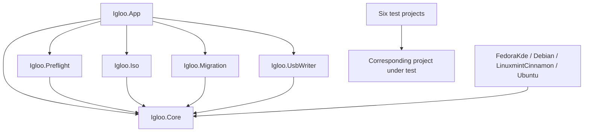
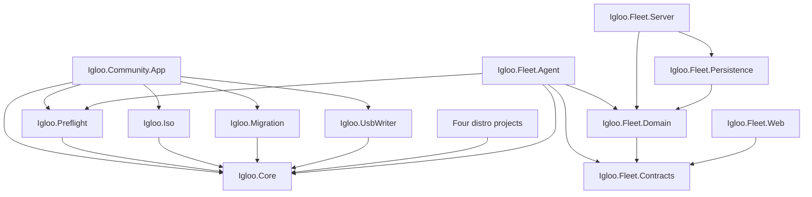

# Community and Fleet product boundaries

One canonical upstream repository and solution, `Igloo.sln`, contains two hosts
around the same migration engine. Community is the local, human-operated WPF
wizard. Fleet is endpoint assessment plus control-plane orchestration. It has no
remote migration execution in either Phase 0 or Phase 1.

Phase 1 preserves the project-reference graph below and Community behavior. It
adds certificate enrollment, SQLite planning persistence, typed read-only work,
evidence-bound approval and non-executable Prepared plans. Fleet.Web is now an
engineering operator CLI as well as a status client; it still references only
Contracts. See the [Phase 1 baseline](../fleet/phase-1-baseline.md) and
[current Fleet architecture](../fleet/architecture.md).

## Inspected baseline

Before edits: clean working tree; .NET SDK 10.0.401 installed on this Windows host;
restore/build succeeded and all 259 tests passed. The project targets are mixed:
Community uses net9.0-windows10.0.19041.0; Core, Iso, Migration and distros use
net8.0; Preflight and UsbWriter use net8.0-windows10.0.19041.0.
No framework or existing package version was upgraded.

The original **project-reference** graph was:



Distro discovery is dynamic through Core's DistroRegistry/DistroLoader, not an
App project reference to every distro. Ubuntu remains in development. Inspection
covered the solution, project files/references, shared abstractions and manifest,
WPF startup and view models, preflight and migration services, tests, distro
projects, architecture/reference documentation, workflows, installer/build
scripts, Directory.Build.props and .editorconfig. There is no checked-in
Directory.Packages file, NuGet configuration or global.json.

## Final solution folders

```text
Igloo.sln
├── Community
│   └── Igloo.Community.App
├── Fleet
│   ├── Igloo.Fleet.Contracts
│   ├── Igloo.Fleet.Domain
│   ├── Igloo.Fleet.Agent
│   ├── Igloo.Fleet.Server
│   ├── Igloo.Fleet.Persistence
│   └── Igloo.Fleet.Web
├── Shared
│   ├── Igloo.Core
│   ├── Igloo.Preflight
│   ├── Igloo.Iso
│   ├── Igloo.Migration
│   └── Igloo.UsbWriter
├── Distros
│   ├── Igloo.Distro.FedoraKde
│   ├── Igloo.Distro.Debian
│   ├── Igloo.Distro.LinuxmintCinnamon
│   └── Igloo.Distro.Ubuntu
└── Tests
    ├── Igloo.Community.App.Tests
    ├── Igloo.Core.Tests
    ├── Igloo.Preflight.Tests
    ├── Igloo.Iso.Tests
    ├── Igloo.Migration.Tests
    ├── Igloo.UsbWriter.Tests
    └── Igloo.Fleet.Tests
```

Source projects live in src/, distro projects in distros/, tests in tests/.

## Final dependencies

Arrows mean a direct ProjectReference. Each original test project references its
subject; Fleet.Tests references Agent, Server and Web.



Agent references Domain to reuse eligibility policy; it does not reference unused
Iso, Migration or UsbWriter functionality. Server cannot reach endpoint services.
Contracts has no project dependencies. Domain owns storage interfaces; Persistence
implements them. ArchitectureTests enforce these direct reference boundaries and
absence of WPF in Fleet. There are no alternate engine implementations.

## Community compatibility and extraction

The App directory, project, root/C# namespaces, XAML classes and App.Tests became
Igloo.Community.App and Igloo.Community.App.Tests. References, friend assemblies,
analyzer file scopes, installer source paths and documentation follow the rename.

Preserved: AssemblyName iGloo (iGloo.exe/iGloo.dll), version 0.2-alpha, app.manifest
identity/elevation, Inno Setup AppId 7B4E9C2A-6F3D-4A1B-9E5C-2D8F0A3B6C71,
installation/shortcut names, %LOCALAPPDATA%/Igloo logs/staging paths, manifest JSON
schema/property names, plugin identities and existing configuration behavior.
No update channel or registry identity is changed.

Classification of code inspected in WPF:
- Views, controls, converters, design data, progress and navigation are UI-only.
- User selection, password/browser/Wi-Fi collection, wallpaper/account picture
  attachment and assembling wizard state are Community orchestration.
- Manifest generation, file staging, direct-install, USB and ISO services already
  reside in shared projects.
- Plugin installer-config/extra-file/first-boot-payload writing was reusable code
  inside FileStagingViewModel. It is now PluginArtifactWriter in Igloo.Migration;
  Community calls it, keeping rendering/write order, bytes and missing-file logs.
  The net8 writer materializes ReadOnlyMemory to byte arrays because the original
  net9 File.WriteAllBytesAsync overload is unavailable in net8.

Community's composition root remains in App.xaml.cs. Agent's composition root
registers only the existing WindowsPreflightChecker plus assessment/identity
services. A new shared DI module is unnecessary for this one registration.

## Execution artifacts are not Fleet records

MigrationManifest remains local execution/handoff state, containing private
migration information. Fleet's MigrationEvidence contains an allowlisted
AssessmentResult plus server receipt time. Fleet never serializes a manifest,
loads user migration state, or collects browser/Wi-Fi credentials.

See [Fleet architecture](../fleet/architecture.md) and
[Phase 0 workflow](../fleet/phase-0.md).
