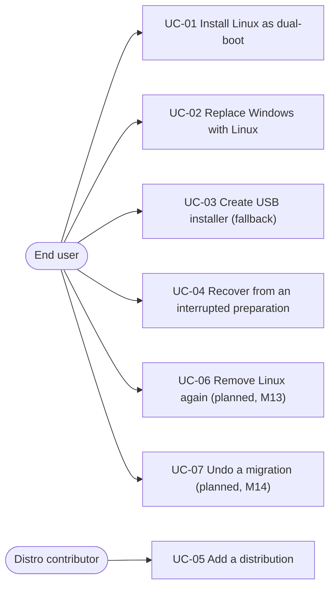

# Actors & use cases

## Actors

| Actor | Description |
|---|---|
| **End user** | Windows user with no Linux or CLI knowledge; owns the machine and the data on it. The primary actor — every design choice is judged against them. |
| **Tester / power user** | Runs alphas and betas, can read logs, files issues. |
| **Distro contributor** | Adds or maintains a distro plugin via pull request. |
| **Distro mirror** *(external system)* | Serves ISOs, checksum files, GPG signatures over HTTPS. |
| **Unattended installer** *(system)* | The distro's own installer (Anaconda / d-i / Ubiquity / subiquity), driven by iGloo's rendered config. |
| **First-boot agent** *(system)* | iGloo's Python agent inside the installed OS; completes migration before first login. |

## Use-case overview

## UC-01 — Install Linux as dual-boot *(primary use case)*

**Goal:** the user's PC boots both Windows and Linux; their files, Wi-Fi and
hardware work in Linux on first login.
**Precondition:** UEFI machine, unencrypted-or-unlocked disk, enough free space,
internet connection.
**Guarantee on any failure:** Windows still boots and is unmodified beyond
already-reported completed steps (BR-01).

**Main success scenario**

1. User launches iGloo; preflight verifies the machine (blockers stop here — BR-06).
2. User picks a distro from the catalog (incompatible ones are greyed out with a reason).
3. iGloo downloads and cryptographically verifies the ISO (BR-02).
4. User selects folders/browser data to migrate and sets username, password, keyboard, disk share.
5. iGloo shrinks Windows, stages the installer on the internal disk, registers a one-shot boot entry, reboots.
6. The distro installer runs fully unattended (BR-04) into the space iGloo freed (BR-03).
7. On first boot — before any login screen — the agent sets keyboard, drivers, codecs, copies files, restores Wi-Fi, adds Windows to the boot menu.
8. User logs in; a welcome screen confirms what was migrated.

**Extensions**

- 1a. Blocker found (BitLocker locked, RAM below distro floor, …) → shown with a concrete remedy; wizard stops. *(BR-06)*
- 3a. Checksum or signature fails → abort with explanation; nothing staged. *(BR-02)*
- 5a. Shrink not possible (unmovable files) → abort cleanly, no disk change.
- 6a. Installer fails mid-run → machine reboots into Windows (one-shot boot entry); logs preserved for diagnosis. *(BR-01, BR-07)*
- 7a. No network on first boot → agent skips network steps, logs them, and the rest completes; a re-run is safe (idempotent, `.done` marker).

## UC-02 — Replace Windows with Linux

As UC-01, but the whole disk is used. Explicit, twice-confirmed choice;
the migration staging then happens *before* partitioning (Windows source
disappears). Same verification and unattended guarantees.

## UC-03 — Create USB installer (fallback)

For machines where the no-USB path is not possible (firmware quirks, policy).
iGloo writes the ISO + seed partition to a USB stick; the rest of the flow
(unattended install, agent) is identical.

## UC-04 — Recover from an interrupted preparation

Wizard or machine died mid-preparation. On re-run, iGloo re-detects its own
partitions by label (`OEMDRV`/`CIDATA`, `IGLOOISO`), reuses them, and re-stages
only what is missing. The ISO cache survives crashes; downloads resume.

## UC-05 — Add a distribution *(contributor)*

Copy `distros/_template/`, fill `distro.json` (ISO + **GPG key with full
fingerprint**), implement the plugin (boot spec + config renderer + agent),
validate in a VM against the checklist. No changes to `src/` (BR-08).
See [distros/README.md](../../distros/README.md) and architecture §6/§9.

## UC-06 — Remove Linux again *(planned, M13)*

Detect an existing Linux install; remove its partitions and boot entries,
restore the Windows bootloader, grow NTFS back. Rationale: **leaving must be as
easy as trying** — reversibility is what makes trying a safe decision (BR-09).

## UC-07 — Undo a migration *(planned, M14)*

One-click rollback shortly after an install: restore the pre-install partition
layout and boot configuration from the snapshot taken in UC-01 step 5.
