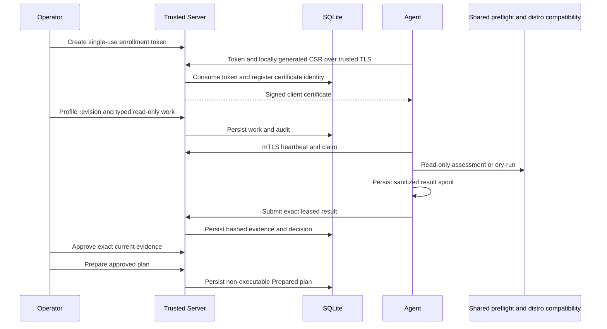

# Fleet architecture

## Phase 1

The trusted mode uses HTTPS enrollment and mTLS Agent requests, a separate operator
authentication seam, durable SQLite transactions and immutable evidence/profile
inputs. The existing project-reference graph is unchanged. The Agent calls the
shared Windows preflight checker and distro compatibility checks; it cannot invoke
migration execution. Fleet.Web supplies a minimal engineering operator CLI.



See [operations](phase-1.md), [security](security.md), [persistence](persistence.md),
[enrollment](enrollment.md), [profiles](migration-profiles.md) and
[dry-run rules](dry-run.md). The following documents the preserved, separate
development protocol; its in-memory storage and token are not used by trusted mode.

## Historical Phase 0 development mode

Fleet is a development foundation for remote migration-readiness assessment.
Its transport workflow works over HTTP but this phase deliberately permits only
local development connections. Production remote enrollment is not implemented.

| Project | Responsibility | Target |
|---|---|---|
| Contracts | Immutable JSON transport records, explicit protocol and error/status enums | net8.0 |
| Domain | Migration lifecycle, eligibility policy, evidence and storage interfaces | net8.0 |
| Agent | One-shot endpoint host; persistent development identity and shared preflight | net8.0-windows10.0.19041.0 |
| Server | ASP.NET Core registration, heartbeat, evidence API | net8.0 |
| Persistence | Thread-safe bounded in-memory development repositories | net8.0 |
| Web | Read-only status API client boundary; no frontend framework or host yet | net8.0 |

[Full project graph and Community compatibility](../architecture/product-boundaries.md).

## Read-only flow

```mermaid
sequenceDiagram
    participant A as Fleet Agent
    participant S as Fleet Server
    participant P as Existing WindowsPreflightChecker
    participant D as Development repositories
    A->>S: Register protocol, UUIDs, versions, capabilities
    S->>D: Record registration
    S-->>A: Accepted protocol and identity
    A->>S: Heartbeat
    A->>P: IPreflightChecker.RunAsync
    P-->>A: Local PreflightReport
    Note over A: Explicit allowlist mapping; no raw report or manifest
    A->>S: AssessmentResult
    S->>S: Validate identity, schema, checks, eligibility
    S->>D: MigrationEvidence with ReceivedAt
    S-->>A: 201 Created and assessment URI
```

This is an Agent-initiated one-shot assessment, not a server job queue or polling
command channel. There are no partition, migration, ISO, reboot or rollout API
operations. Network failure never invokes remediation or a different local path.

WindowsPreflightChecker's existing path queries WMI/registry/display APIs, uses
GetSupportedSize for sizing, and may read EFI entries, ESP files and ext4 UUIDs
through existing volume paths/read-only raw disk handles. It does not mount new
volumes, resize partitions, stage files or write firmware. Destructive services
also happen to live in Igloo.Preflight; none are registered or called by Agent.

The existing checker can return Unknown, empty inventories or fallback values
when access is unavailable. Fleet treats unknown BitLocker/RAM/disk results as
NeedsReview and preserves known warnings/blockers. Firmware probes use existing
boolean fallbacks; evidence is not a guarantee of hardware probe completeness.
No distro profile is selected and no distro-specific compatibility evaluation
runs in Phase 0. ReadyForReview is never migration approval.

## Identity, authentication and exposure

IDeviceIdentityProvider isolates identity. DevelopmentDeviceIdentityProvider
stores random DeviceId/AgentId GUIDs in
%LOCALAPPDATA%/Igloo/Fleet/development-identity.json. Repeated runs reuse them.
CreateNew prevents overwrite races; invalid/partial identity files fail closed.
This is per Windows user in development, not a certificate or machine-wide
identity. Backup/restore and service-account ownership need a production design.

Both executables require --development-local. IGLOO_FLEET_DEV_TOKEN must contain
at least 32 characters; use a generated secret. Every API requires the token.
IFleetAgentAuthenticator is the replaceable server authentication boundary.
The development implementation compares token hashes in constant time.

Server binds only 127.0.0.1:5187, rejects custom Kestrel endpoint configuration and
disables endpoint configuration reload. Command-line endpoint overrides are
rejected. Explicit Kestrel listening takes precedence over ASPNETCORE_URLS.
Agent uses that fixed loopback address, disables proxies and redirects.
There is no CORS policy allowing browser applications.

**Development security only:** the shared token has access to all development
records and does not prove which Agent sent a request. There is no per-device
authorization, mTLS, certificate rotation, operator authentication or durable
enrollment. HTTP is acceptable only within this loopback development boundary.
Do not put a proxy/tunnel in front of it or expose it on a LAN.

## Protocol and validation

Protocol is explicit { major: 1, minor: 0 }; both sides reject other versions.
The initial server supports Agent 0.1.0. IglooVersion identifies the existing Core
assembly version, not Community's product version. PreflightSchema 1 identifies
the Fleet mapping; shared Preflight has no separate report schema version.

The JSON protocol uses camelCase HTTP fields and numeric enums. Values are frozen
for v1; incompatible additions require an explicitly supported protocol/mapping.
Unknown JSON fields are rejected by Server. Assessment validation rejects
invalid enum values, missing/duplicate checks, invalid UUIDs/versions/timestamps,
unsupported schemas, unregistered/mismatched identities and inconsistent
eligibility. Registration versions must match submitted evidence.

Checks: Firmware=0, SecureBoot=1, Tpm=2, BitLocker=3, Memory=4, Disks=5,
UnknownFinding=6. Status: Passed=0, Information=1, Warning=2, Blocked=3, Unknown=4.
Eligibility: ReadyForReview=0, NeedsReview=1, Blocked=2.
Outcome: Assessed=0, LocalExecutionFailed=1.

FleetError separates CommunicationFailure, UnsupportedAgentVersion,
UnsupportedProtocol, InvalidRequest, PreflightBlocker, LocalExecutionFailure,
ServerFailure, EnrollmentFailure, NotFound and Conflict. A preflight blocker is
valid evidence (HTTP 201), not a transport failure. Local execution failure is
sanitized to an outcome, empty checks and NeedsReview. Cancellation is propagated.
Error responses contain fixed diagnostics, never raw endpoint exceptions.

## Privacy and evidence

Sent: random device/agent/assessment IDs, protocol/schema, agent/Core versions,
start/end timestamps, RAM byte count, disk count, fixed check IDs/statuses,
eligibility and outcome. Server adds receipt time and heartbeat time locally.

Never mapped: hostname, volume labels, disk/GPU names or identifiers, partition
details, monitor layout, EFI inventory, findings' free-text code/message/remedy,
manifest, user paths/documents, browser credentials, Wi-Fi passwords, account
images, wallpaper or exception text. Unknown finding codes map to a fixed
UnknownFinding check. Agent suppresses detailed shared-preflight logging and
logs only assessment identifiers, outcome and eligibility.

## Lifecycle and persistence

MigrationRun rejects illegal transitions. The modeled happy path is Discovered
through Assessed, Eligible, Approved, Scheduled, Preparing, Prepared, Migrating,
FirstBoot, Validating and Completed. Explicit blocked/reassessment, failure,
recovery and cancellation paths exist. Terminal states cannot restart execution.
These are domain transitions, not remotely executable operations.

IDeviceRepository and IAssessmentRepository belong to Domain. InMemoryFleetStore
serializes concurrent access, rejects identity collisions and evidence replacement,
and caps each collection at 1,000 records. Restart loses all registrations/evidence;
capacity returns Conflict. No database or distributed infrastructure is selected.

## Next milestone and risks

Phase 1 should add a migration profile, remote dry-run, eligibility evidence,
operator approval and a prepared-but-not-executed job. First design authenticated
certificate enrollment/authorization and durable evidence storage. Review the
existing best-effort probe semantics and add explicit probe completeness.
Do not add remote destructive execution as a shortcut.

Remaining limitations include per-user development identity, volatile evidence,
no offline evidence spool/retry/job correlation, no production service lifecycle,
no independent attestation, and no automated installer-upgrade or destructive
Community VM migration test in this change.
